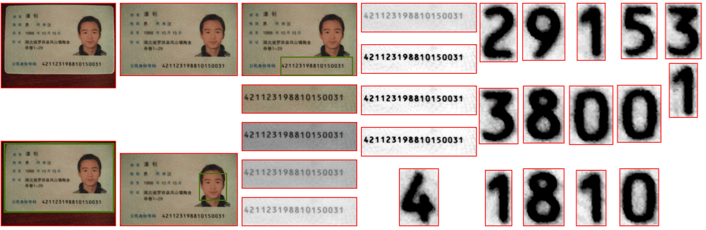
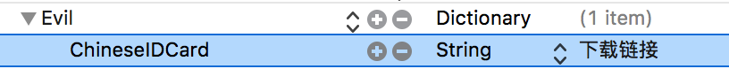

# Evil

银行卡、身份证、门牌号光学识别  
OCR(`Optical Character Recognition`) in Swift for iOS&macOS.



##  Requirements

 - iOS 11.0+ / macOS 10.13+
 - Xcode9.2+
 - Swift 4.0+

## [Installation](installation.md)

## Basic Usage

Evil 使用 [Vision](https://developer.apple.com/documentation/vision) 框架进行文字识别，因此你需要导入特定的[MLModel](https://developer.apple.com/documentation/coreml/mlmodel)到你的Xcode工程。例如识别身份证导入识别身份证的model，识别银行卡导入识别银行卡的model。

以下是目前已经训练好的模型

 - ChineseIDCard ==>  [🇨🇳中国二代身份证号码识别](http://ou5pk1mdu.bkt.clouddn.com/ChineseIDCard.mlmodel)

### 如何导入

首先从上面的地址下载或者自己训练得到模型文件(`*.mlmodel`)，然后作为resource资源加入项目。但是模型文件size一般都比较大因此Evil还支持另外一种方式即：运行时从指定的服务器下载对应的模型。

 1.  获取对应的模型文件并重名命名为`[name].mlmodel` 
     `[name]`可通过以下方法获取`print(Recognizer.chineseIDCard.name)`
2. 将模型文件上传至自己的服务器或者CDN并获取下载链接
3. 在`info.plist` 中配置下载链接如下



### 初始化

``` Swift
lazy var evil = try? Evil(recognizer: .chineseIDCard)
```

或者 手动指定下载路径

``` Swift
let downloadURL = URL(string: "https://****/ChineseIDCard.mlmodel")!
let chineseIDCard = Recognizer.custom(name: "ChineseIDCard", model: downloadURL, needComplie: true, processor: Recognizer.cropChineseIDCardNumberArea)
let evil = try? Evil(recognizer: chineseIDCard)
```

或者直接将模型文件拖入 xcode 项目
``` Swift
let url = Bundle.main.url(forResource: "ChineseIDCard", withExtension: "mlmodelc")!
let evil = try? Evil(contentsOf: url, name: "ChineseIDCard")
```
注意Extension 为`mlmodelc`而不是`mlmodel`因为xcode会自动编译`mlmodel`文件，并且生成对应的`class`. 所以请务必注意Model文件不要和现有的`class`重名。

### 开始识别

``` Swift
let image: Recognizable = .....
let result = evil?.recognize(image)
print(result)
```

## 训练模型
参考Tools 目录下`PrepareBot`项目

## 交流讨论
	1.github issue (推荐)
	2.qq 群：641256202

## LICENSE
	 MIT

Copyright 2018 - 2019 Kevin.Gong aoxianglele#icloud.com
